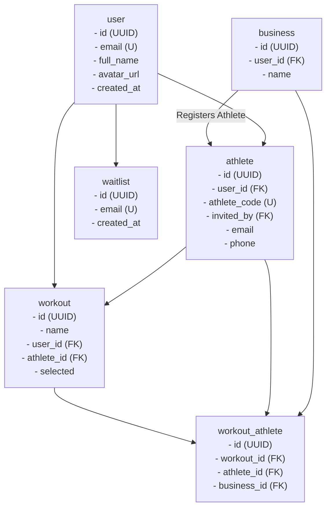

<div align="center">

# GymBrah

Build better tiny habits to get fit and healthy.

[💬 Discord](https://discord.gg/)&nbsp;&nbsp;&nbsp;&nbsp;&nbsp;[🚀 Join](https://www.gymbrah.com)

</div>

## Database Flow

This documentation outlines the database architecture and flow within the GymBrah application, focusing on the athlete onboarding process facilitated by the `athlete_code` system. The following diagram illustrates the interaction between key tables:



## 📌 How the Flow Works

1️⃣ **Gym Registers an Athlete**

- Creates a new athlete record with a unique `athlete_code`.
- Sends an invitation email/SMS containing the `athlete_code` for the athlete to join.

2️⃣ **Athlete Signs Up**

- If the athlete's email matches an existing invite, the user is automatically linked to the athlete record.
- If not, the athlete can manually enter the `athlete_code` to associate their account.

3️⃣ **Workout Assignment & Tracking**

- The `workout_athlete` table manages the association between workouts and athletes.
- Gyms can assign workouts to athletes even before the athletes have completed their signup process.

## 🔧 Useful Tips for Managing the App

### Database Schema Management

- **Prisma Migrate:** Use Prisma Migrate to handle schema changes smoothly. Run `npx prisma migrate dev` to apply migrations.
- **Client Generation:** After updating the schema, generate the Prisma client with `npx prisma generate` to ensure type safety and access to the latest models.

### Data Integrity

- **Relations:** Utilize Prisma's relational mappings to maintain referential integrity between tables.
- **Transactions:** Use transactions for bulk operations to ensure atomicity and consistency.

### Athlete Onboarding

- **Unique Codes:** Ensure `athlete_code` uniqueness by enforcing constraints in the Prisma schema.
- **Validation:** Implement front-end and back-end validation for `athlete_code` during the signup process to prevent errors.

### Performance Optimization

- **Indexing:** Index frequently queried fields such as `user_id`, `athlete_code`, and foreign keys to enhance query performance.
- **Lazy Loading:** Utilize Prisma's lazy loading features to fetch related records only when necessary, reducing initial load times.

### Security Best Practices

- **Authentication & Authorization:** Protect sensitive endpoints with robust authentication mechanisms and ensure proper authorization checks.
- **Input Sanitization:** Sanitize and validate all inputs, especially user-generated content and `athlete_code`, to prevent injection attacks.

### Monitoring & Maintenance

- **Database Backups:** Regularly back up your PostgreSQL database to prevent data loss. Consider automated backup solutions.
- **Performance Monitoring:** Use tools like PgAdmin or other PostgreSQL monitoring solutions to keep an eye on database performance and identify bottlenecks.

### Development Workflow

- **Version Control:** Keep your Prisma schema and migrations under version control to track changes and collaborate effectively.
- **Environment Management:** Use environment variables to manage different configurations for development, staging, and production environments.

By adhering to these guidelines, you can ensure a robust, secure, and maintainable database structure that supports the GymBrah application's growth and scalability.

```

```
